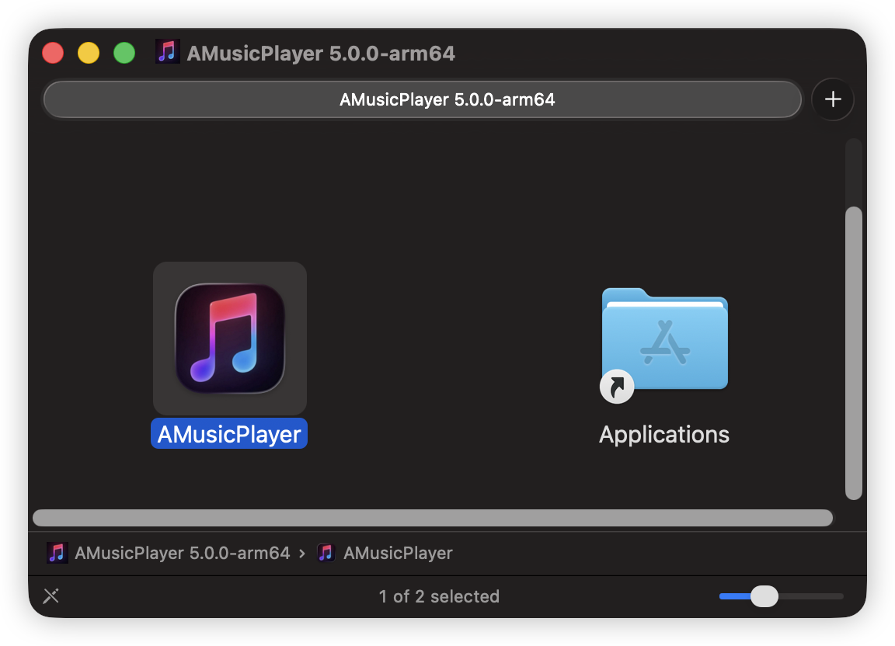

# AMusicPlayer (macOS 优化版 / macOS‑optimized)

本项目基于 AlgerMusicPlayer，遵循其 MIT 开源协议。

This project is based on AlgerMusicPlayer and follows its MIT license.

- 本项目地址：https://github.com/ChiamZhang/AMusicPlayer 
- 原作者项目地址：https://github.com/algerkong/AlgerMusicPlayer    如果可以请给原作者点个 Star！！！

— [简体中文](#简体中文) | [English](#english) —

## 简体中文

### 简介
- 面向 macOS 的 AMusicPlayer 优化版本，突出原生风格与细节打磨。
- 保留核心体验，适度精简非必要元素，提升稳定与易用性。

### 说明
本项目主要针对 macOS 进行优化，重点打磨界面细节，并移除一些与核心体验无关的内容。
由于没Apple 开发者账户，所以安装后执行：
```bash
sudo xattr -cr /Applications/AMusicPlayer.app 
```

### 主要改动
1. 图标调整（适配 macOS Menu Bar）
2. 配色调整（浅绿色 → 浅蓝色）
3. 界面仅保留基础功能，移除多余元素（对不起原作者的大大，求原谅 QaQ）
4. 适配 macOS 关闭与最小化图标
5. 在此基础上重新调整布局细节
6. 账号登录页面统一风格
7. 精简导航：用户与设置入口在右上角头像保留
8. 压缩应用体积：安装包约 138MB，安装后约 332MB

## TODO
1. []歌词界面专辑不是正方形的非常难受，待修改。
2. []主页很多地方排布不合理，整体来看不是正方形非常难受下方根本对不齐
3. []最新专辑和右边的那些歌手推荐都应该放到搜索页面，搜索页面简陋需要重新设计。
4. []歌单分类对不齐，我真的对不起了，好难受！！！
5. []主页跟歌单页重复，歌单页有的东西主页都有，主页真的要好好考虑如何重构一下。
6. []很多页面是页面内容能滑动，页面也能滑动，这不太合理，应该使得页面固定，只让内容去滑动。


### 使用与反馈
由于个人水平有限，不准备 PR 回原项目。Bug 提 Issue，随缘修复。

### 截图




PS：代码里的名字已统一为 AMusicPlayer。

 

### 许可证
遵循 MIT 开源协议；请在分发或修改时保留许可证与相关说明。

### 致谢
感谢所有参与与支持的开发者与用户。

本项目基于原作者的项目进行优化与调整，谨此致敬并感谢原作者的辛勤付出。
其中移除的内容主要包括原作者的赞助码。我非常尊重原作者的劳动与付出，因此在本项目中移除赞助码是为了避免误导用户。如果你认可原作者的努力，请前往原作者项目进行支持与赞赏，我本人不接受任何赞助。

AMusicPlayer 的名字来自于原作者 AlgerMusicPlayer，我在此基础上修改，想纯粹一点所以删掉了 Alger 的 lger 变成了 A，哈哈哈哈哈哈，搞笑的来历。
感谢原作者的创作与开发，大佬太强了。

---

## English

### Introduction
- AMusicPlayer optimized for macOS with a more native look-and-feel and refined UI details.
- Core experience is preserved while trimming non-essential elements for stability and usability.

### Notes
This edition focuses on macOS-specific optimizations, UI polish, and removal of features not critical to the core experience.

### Key Changes
1. Icon adjustments (tailored for the macOS Menu Bar)
2. Color scheme tuned (light green → light blue)
3. Keep essentials, remove extraneous UI elements (with respect to the original author)
4. macOS-style close and minimize controls
5. Layout refinements across views
6. Unified styling for the account login page
7. Simplified navigation: user and settings accessible via the top-right avatar
8. Reduced app size: installer ~138 MB; installed size ~332 MB

### Usage & Feedback
Due to limited bandwidth, PRs are not accepted. Report critical issues by email and minor ones via Issues; fixes are best‑effort.

### Screenshots
See the screenshots in the Chinese section above.

### Project Links
- This project: https://github.com/ChiamZhang/AMusicPlayer
- Original project: https://github.com/algerkong/AlgerMusicPlayer

### License
Released under the MIT License. Please retain the license and attribution when distributing or modifying.

### Acknowledgements
This work builds upon the original author's project. Sincere thanks and respect to the original author.

Some content (e.g., the original sponsorship code) was removed to avoid user confusion. If you appreciate the original work, please support the original project. I do not accept donations.

The name "AMusicPlayer" derives from "AlgerMusicPlayer"—I simplified it by dropping "lger" to just "A". Thanks to the original author for their excellent creation.
